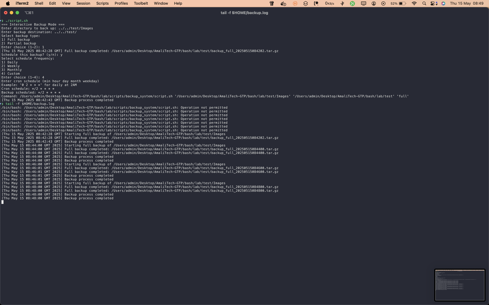
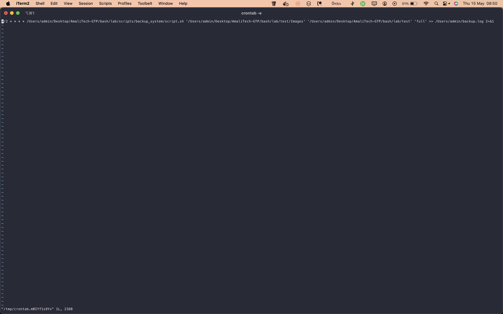
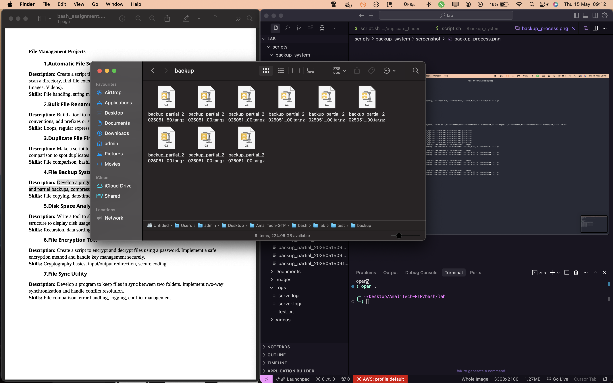

# Backup System

This utility automates system backups, allowing you to schedule and manage backups efficiently.

## Files

- `script.sh`: Main script to perform and schedule backups.
- `screenshot/`: Contains images demonstrating the script in action.

## Usage

Run the script with appropriate permissions:

```bash
bash script.sh
```

Follow the interactive prompts to:

- Enter the source directory to back up
- Enter the backup destination directory
- Choose backup type: Full (all files) or Partial (by file extension)
- (For partial) Enter file extensions to include (e.g., .txt .jpg)
- Optionally schedule the backup (daily, weekly, monthly, or custom cron)

The script supports both interactive mode and command-line arguments (for cron jobs).

## Screenshots

### Backup Process


_The script is actively creating a backup, showing progress and details of files being processed._

### Crontab Injection


_This screenshot demonstrates how the script adds a scheduled backup job to the system's crontab, automating regular backups._

### Effect


_Displays the result after a successful backup, confirming completion and showing the backup location or summary._
