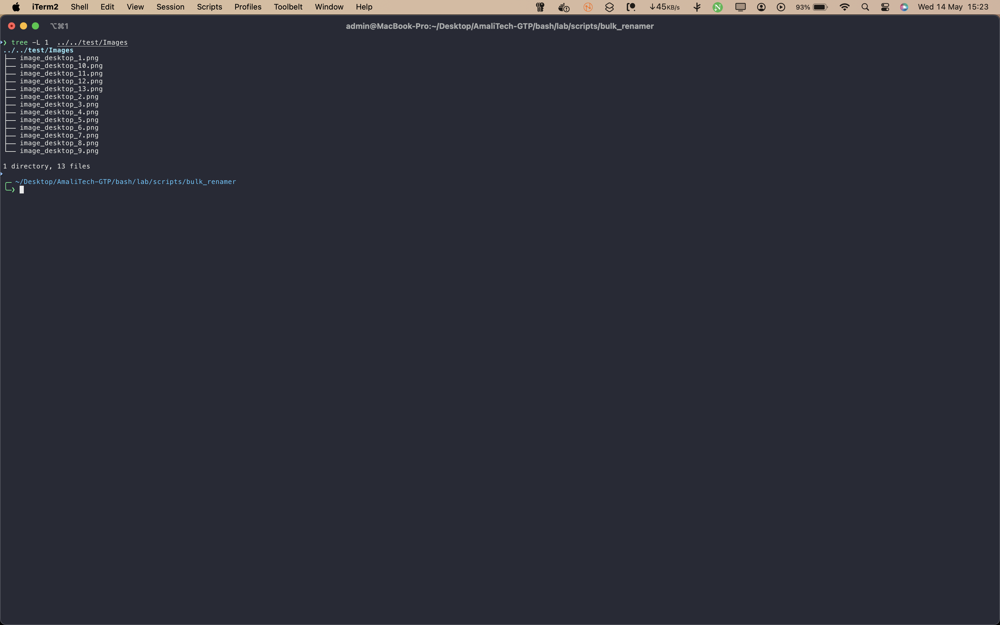
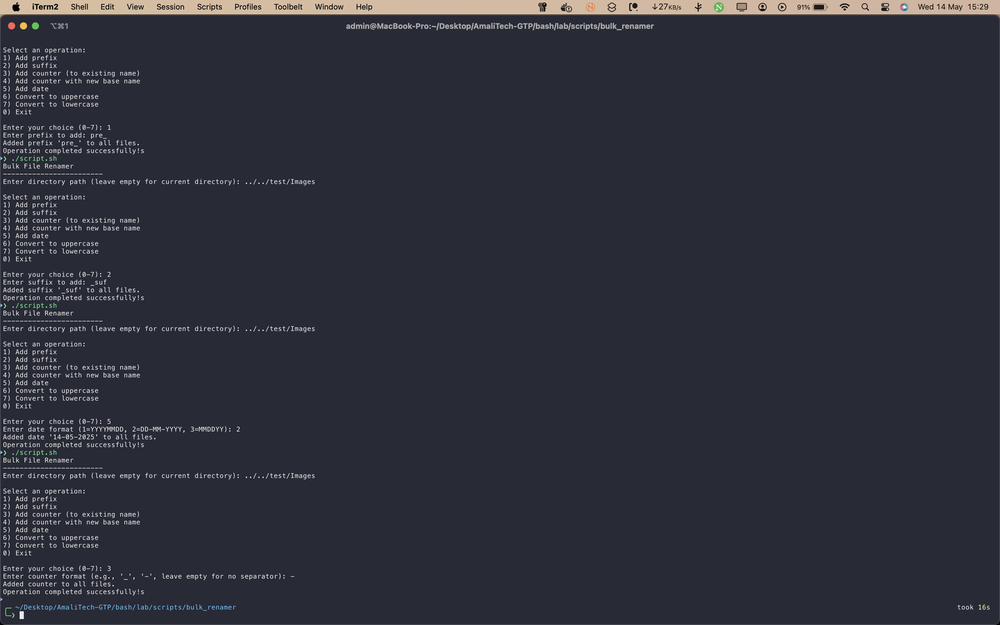
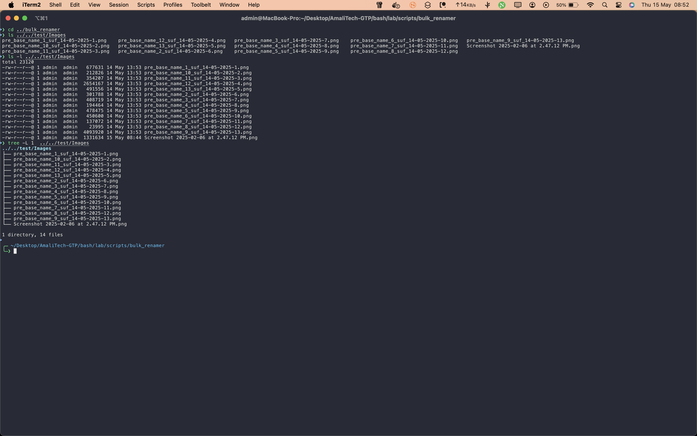

# Bulk Renamer

This script allows you to rename multiple files in bulk using customizable patterns, making file organization fast and efficient.

## Files

- `script.sh`: Main script to perform bulk renaming operations.
- `screenshot/`: Contains images demonstrating the script in action.

## Usage

Run the script and follow the prompts:

```bash
bash script.sh
```

You will be prompted to enter the directory path (leave empty for current directory). Then, select a renaming operation from the menu:

- Add prefix
- Add suffix
- Add counter (to existing name)
- Add counter with new base name
- Add date
- Convert to uppercase
- Convert to lowercase
- Exit

Follow the on-screen instructions for each operation.

## Screenshots

### Before Renaming


_Shows the directory and file names before any renaming operation is performed._

### Renaming Process


_Demonstrates the script in action, processing files and applying the renaming pattern._

### After Renaming


_Displays the directory after the renaming is complete, with new file names applied._
