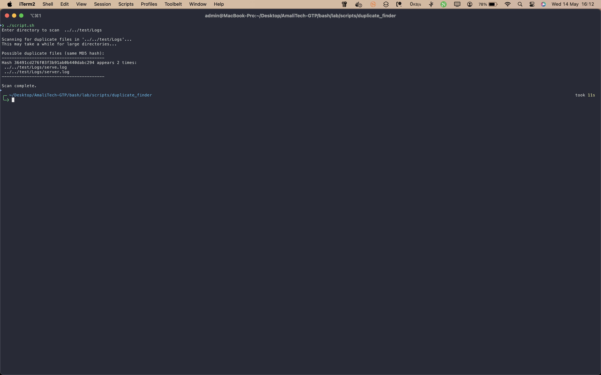

# Duplicate Finder

This script scans directories to find and report duplicate files, helping you free up disk space and maintain a tidy file system.

## Files

- `script.sh`: Main script to detect duplicate files.
- `screenshot/`: Contains images demonstrating the script in action.

## Usage

Run the script and follow the prompt to specify the target directory:

```bash
bash script.sh
```

You will be prompted to enter the directory to scan for duplicates. The script will then analyze files and report any duplicates found.

## Screenshot


_The script has detected duplicate files in the specified directory and displays the results, making it easy to identify and remove redundant files._
