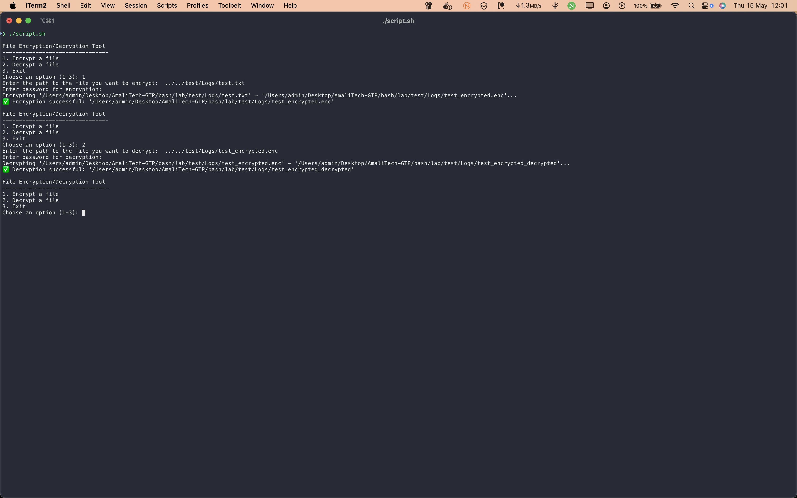

# File Encrypter

This script provides a simple way to encrypt and decrypt files, ensuring your sensitive data remains secure.

## Files

- `script.sh`: Main script to encrypt and decrypt files.
- `screenshot/`: Contains images demonstrating the script in action.

## Usage

Run the script and follow the interactive menu to choose encryption or decryption:

```bash
bash script.sh
```

You will be presented with a menu:

- Encrypt a file
- Decrypt a file
- Exit

For encryption or decryption, you will be prompted to enter the file path and a password (entered securely, not shown on screen).

## Screenshot


_The script displays its usage options, allowing the user to select between encrypting and decrypting files, and shows example commands and prompts._
