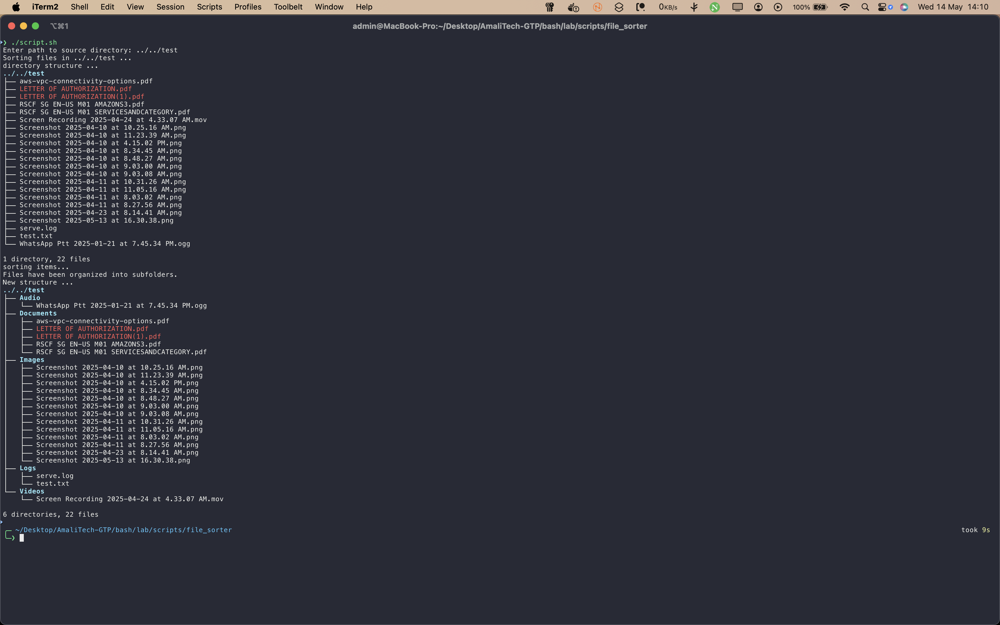

# File Sorter

This script sorts files into folders based on their type or other criteria, helping you keep your directories organized automatically.

## Files

- `script.sh`: Main script to sort files.
- `screenshot/`: Contains images demonstrating the script in action.

## Usage

Run the script and follow the prompt to specify the directory to sort:

```bash
bash script.sh
```

You will be prompted to enter the path to the source directory. The script will then organize files into subfolders: Documents, Images, Videos, Audio, and Logs.

## Screenshot


_This screenshot shows the directory structure before and after running the script, highlighting how files are organized into appropriate folders._
