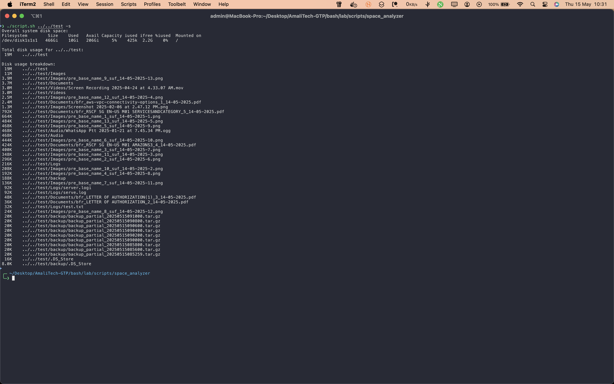

# Space Analyzer

This script analyzes disk space usage, helping you identify large files and folders to optimize your storage. It provides a breakdown of disk usage, supports sorting and filtering, and displays overall system disk space.

## Files

- `script.sh`: Main script to analyze disk space.
- `screenshot/`: Contains images demonstrating the script in action.

## Usage

Run the script with optional arguments to customize the analysis:

```bash
bash script.sh [directory] [-s] [-f 'filter']
```

- `directory`: The starting directory for analysis (default is current directory)
- `-s`: Sort results by size (largest first)
- `-f 'filter'`: Filter results to include only files/directories matching the filter string

### Examples

- Analyze the current directory:
  ```bash
  bash script.sh
  ```
- Analyze a specific directory (e.g., /home/user/Documents):
  ```bash
  bash script.sh /home/user/Documents
  ```
- Sort results by size:
  ```bash
  bash script.sh -s
  ```
- Filter results to show only files containing 'log':
  ```bash
  bash script.sh -f 'log'
  ```
- Combine options (e.g., sort and filter in /var/log):
  ```bash
  bash script.sh /var/log -s -f 'error'
  ```

## Screenshot


_The script displays a summary of disk space usage, highlighting the largest files and folders to help you manage storage efficiently._
